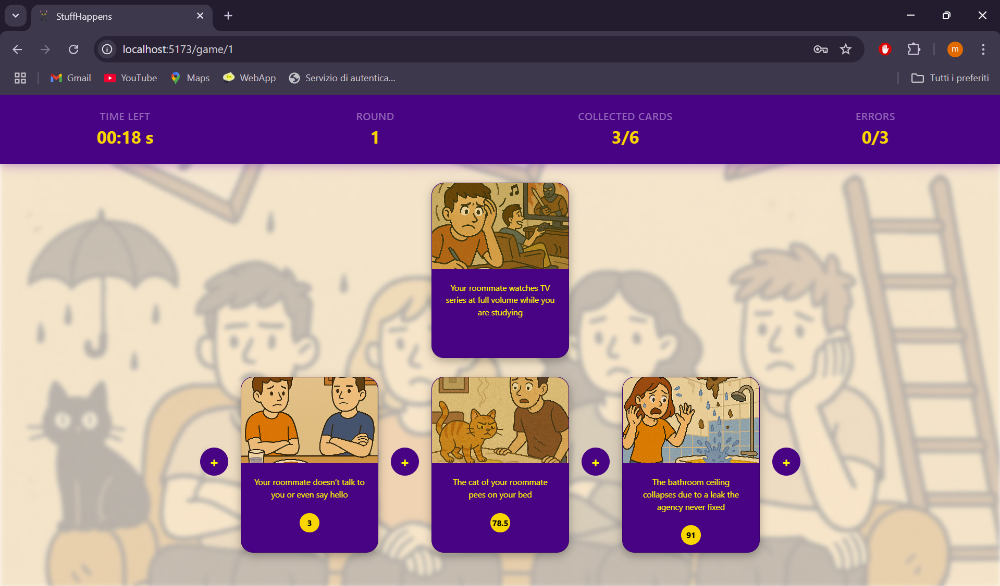
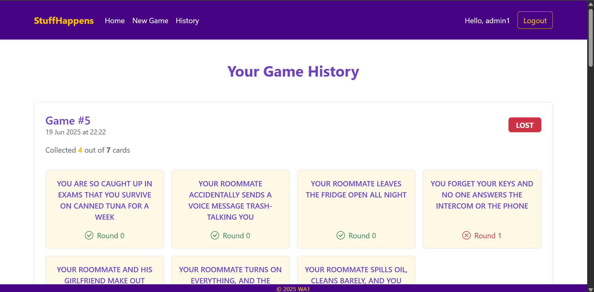

# Exam #1: "StuffHappens"

## React Client Application Routes

- Route `/`: redirects to `LayoutComponent`, containing `HomeComponent` and `FooterComponent`. Acts as the homepage, allowing users to start a game or access different features based on authentication status
- Route `/login`: it contains the login form and allows authentication
- Route `/history`: displays a history of games played by the user, with detailed information on each game and its rounds
- Route `/game/demo`: handles the game in demo mode for unregistered users
- Route `/game/:gameId`: handles the game for registered users

## API Server

- POST `/api/login`
  - description: logs in
  - request parameters and request body content
    ```json
      {
        "username": "admin@polito.it",
        "password": "password"
      }
    ```
  - response body content
    ```json
      {
        "id": 1,
        "email": "admin@polito.it",
        "name": "admin1"
      }
    ```
  - response code
    - `200 Created`
    - `401 Unauthorized`

- GET `/api/login/session`
  - description: : checks if the user is still  authenticated
  - response body content
    ```json
      {
        "id": 1,
        "email": "admin@polito.it",
        "name": "admin1"
      }
    ```
  - response code
    `200 Created`
    `401 Unauthorized`

- POST `/api/logout`
  - description: logs out
  - response code
    `200 OK`

- GET `/api/game/:gameId`
  - description: get a game by its id
  - response body content
    ```json
      {
        "cards": {
          "badLuckIndex": 1,
          "cardId": 1,
          "gameId": 8,
          "image": "card1.png",
          "name": "Your roomate wake you up..",
          "outcome": 1,
          "wonInRound": 0,
        },
        "gameId": 8,
        "numberOfCards": 3,
        "startTime": "2025-06-18 19:35:51",
        "userId": 1
      }
    ```
  - response code
    `200 OK`
    `400 Invalid game ID`
    `404 Game not found`
    `500 Internal Server Error`

- POST `/api/games`
  - description: add a new game
  - response body content
      ```json
        {
          "gameId": 8,
          "cards": {
            "cardId": 1,
            "name": "Your roomate wake you up..",
            "image": "card1.png",
            "badLuckIndex": 1
          },
        }
      ```
  - response code
    `201 created`
    `400 Missing required fields`
    `500 Internal Server Error`

- POST `/api/demoGame`
  - description: start a demo game
  - response body content
    ```json
      {
        "cards": {
          "cardId": 1,
          "name": "Your roomate wake you up..",
          "image": "card1.png",
          "badLuckIndex": 1,
        },
        "currentCard": {
          "cardId": 11,
          "name": "The toilet paper runs out...",
          "image": "card11.png",
          "badLuckIndex": 19,
        }
      }
    ```
  - response code
    `201 OK`
    `500 Internal Server Error`

- POST `/api/games/:gameId/round`
  - description: create a new round
  - response body content
    ```json
      {
        "cardId": 47,
        "name": "There's a mouse in the house..",
        "image": "card47.png",
      }
    ```
  - response code
    `200 OK`
    `404 Not found Error - no more cards`

- GET `/api/games/:gameId/round/current`
  - description: returns time left for current round
  - request parameters
    ```json
      {
        "gameId": 10
      }
    ```
  - response body content
    ```json
      {
        "timeLeft": 17
      }
    ```
  - response code
    `200 OK`
    `404 Not found Error - no round found`

- POST `/api/games/:gameId/round/timeout`
  - description: handles the round ending by timeout
  - response body content
    ```json
      {
        "result": "timeout"
      }
    ```
  - response code
    `200 OK`
    `400 No round in-progress`
    
- POST `/api/games/:gameId/guess`
  - description: guess the card
  - request parameters
    ```json
      {
        "cardId": 40,
        "position": 4, 
      }
  - response body content
    ```json
      {
        "card": {
            "cardId": 1,
            "name": "Your roomate wake you up..",
            "image": "card1.png",
            "badLuckIndex": 1
          },
        "result": "correct"
      }
    ```
  - response code
    `200 OK`

- GET `/api/games/history`
  - description: get the history of the games  
  - response body content
    ```json
      {
        "cards": {},
        "collectedCards": {},
        "gameId": 9,
        "startTime": "2025-06-17 17:56:03",
        "status": "lost",
        "userId": 1
      }

  - response code
    `200 OK`
    `500 Error retrieving history`


## Database Tables

- Table `user` - contains:
  - userId: INTEGER PRIMARY KEY AUTOINCREMENT
  - email: TEXT NOT NULL UNIQUE, used as username
  - name: TEXT
  - saltedPassword: TEXT
  - salt: TEXT NOT NULL
- Table `card` - contains:
  - cardId: INTEGER PRIMARY KEY AUTOINCREMENT
  - name: TEXT
  - image: TEXT
  - badLuckIndex: REAL UNIQUE
- Table `game` - contains:
  - gameId: INTEGER PRIMARY KEY AUTOINCREMENT 
  - userId: INTEGER, foreign key references user(userId)
  - status: TEXT NOT NULL - in-progress, won, lost
  - startTime: DATETIME - current timestamp
- Table `round` - contains:
  - roundId: INTEGER PRIMARY KEY AUTOINCREMENT
  - gameId: INTEGER, foreign key references game(gameId)
  - cardId: INTEGER, foreign key references card(cardId)
  - roundNumber: INTEGER NOT NULL
  - result: TEXT - won, lost
  - position: INTEGER
  - startTime: DATETIME
- Table `cardInGame` - contains:
  - gameId: INTEGER, primary key, foreign key references game(gameId)
  - cardId: INTEGER, primary key, foreign key references card(cardId)
  - outcome: INTEGER
  - wonInRound: INTEGER

## Main React Components

- `LoginForm`: it contains the login form for user authentication
- `NavbarComponent`: when the user is not authenticated, tabs are available to navigate to the home page, start a new game in demo mode, and access the login form.
When authenticated, the user can also view game history, start a full game, and the login button is replaced with a logout button
- `HomeComponent`: the homepage includes a button to start a new game. If the user is not authenticated, it also shows a button to view the game instructions
- `GameComponent`: it represents the game itself. The game view shows the card to be placed and the cards already won. At the top of the page, it displays key game information such as the timer, round count, collected cards, and number of mistakes
- `HistoryComponent`: it presents a log of past games, with information on each round and the final result
- `TimerComponent`: it contains the 30-second timer used to track the time limit for selecting the card to place

(only _main_ components, minor ones may be skipped)

## Screenshot




## Users Credentials

- `admin@polito.it`, `password`
- `admin2@polito.it`, `password`
